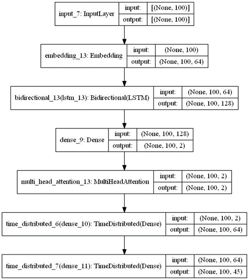
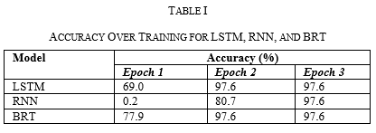
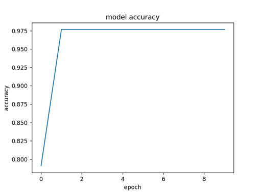
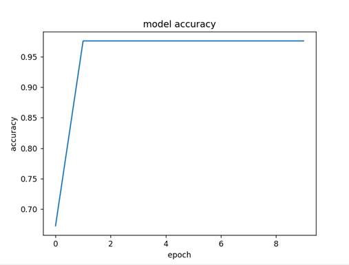
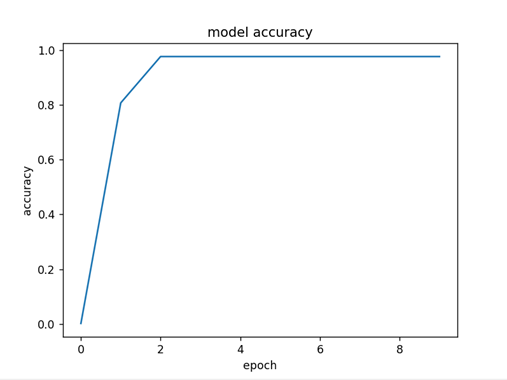
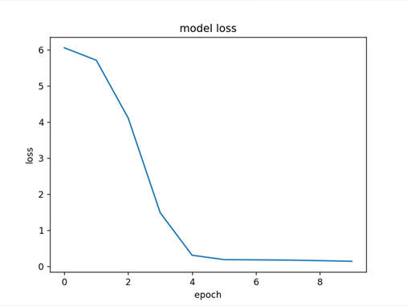
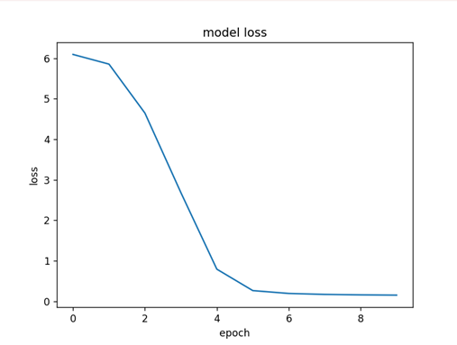
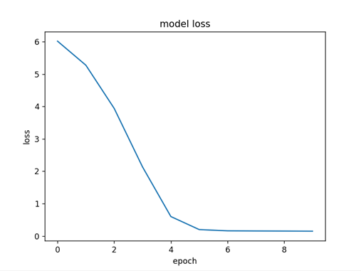

# AWPS using BRT

Delhi Technological University Final Year Project

Model Description
Our BRT model performs its actions using four simple steps. These steps are Input Encoding, Block Recurrent Network, Self-Attention, and Output Decoding.
The first step in the BRT model is input embedding. The input problem is first tokenized into a set of readable tokens for the model. Then the tokens are embedded using an embedding layer. The embeddings represent each element of the input sequence as a greater-dimensional vector.
Each of the recurrent blocks in a BRT have a self-attention mechanism. This mimics to the self-attention used in transformers. The model is able to choose which section of the input problem to solve first based on the related context using this mechanism.
The final step is decoding the output. The output sequence is generated using a decoder. The input given is the final hidden state of the last recurrent block. The decoder uses an output embedding layer to generate the output sequence, which can be a sequence of words, labels, or any other sequential output. 
To use BRT for arithmetic problem solving, we first pre-process the input data by converting the text-based problem statements into a structured format that can be fed into the model. We then train the BRT model using a supervised learning approach, where the model's parameters are optimised to reduce the discrepancies between its predicted output and the true solution to the problem.

The figure shows the model architecture of our BRT model. The first layer is an Embedding layer. This layer takes the input question size and the input sequence length as parameters. It maps each word index to a dense vector representation of size 64. The second layer is a Bidirectional LSTM layer with 64 units. The Bidirectional layer processes the input sequence in both forward and backward directions, capturing dependencies in both directions. The next layer is a Dense Layer followed by the MultiHeadAttention layer and then a TimeDistributed layer. The TimeDistributed wrapper applies the same Dense layer to each time step of the input sequence independently. After that, another TimeDistributed layer with a Dense layer and softmax activation is added. This layer produces the output predictions for each time step.

Dataset Used
We generated a dataset of our own to test the model on. Our dataset consists of 500 English arithmetic word problems. The problems vary in complexity and structure but are generally of elementary school difficulty. The problems were found by scouring the web on a variety of different websites with the aid of web scraping AI tools.
The dataset is structured in such a way: question and equation split by three vertical bars. The equation does not give the answer as it is made to test the capabilities of a model to generate an equation.
We pre-process the data by tokenizing the text and encoding the numerical values using one-hot encoding. The validation set of the dataset consists of 20% of the data. The training set is the rest of 80% of the dataset. Once the model is trained on the 80 side of the dataset, it will then be validated on the 20 side by our program to confirm our model accuracy.

Results and Comparisons

We compared our model to other similar models in the field. Our model outperforms the older models. The improvement over the models is can be seen and it can be said that the BRT model achieves very promising performance in solving arithmetic word problems.

BRT Model Accuracy

LSTM Model Accuracy

RNN Model Accuracy

As shown in the accuracy graphs, BRT reaches higher accuracies at lower epochs.While the overall final accuracy is similar to that of other models but there are some key differences in the middle of the graphs. As shown by the above graphs, BRT achieves the same accuracy as the LSTM and RNN after sufficient training is done on our dataset. On the other hand, BRT achieves higher initial accuracy. Contrarily, RNN takes longer to get to the achieved accuracy. This shows that over a larger or more complex database, the BRT model will surpass in performance when compared to LSTM and RNN.

BRT Model Loss

LSTM Model Loss

RNN Model Loss

As shown in the loss graphs, the model reaches optimal model loss after around 4 epochs. We can also see that model loss for LSTM and RNN respectively. The model loss for both LSTM and RNN take one epoch longer to get to a loss factor similar to that of BRT. This can show that BRT is trained more effectively than LSTM and RNN. Contrarily, both models have a similar trend to that of BRT.

Future Scope
The future of Arithmetic Word Problem Solving has much to explore. Primarily, the exploration of the use of these AI models in a classroom is of utmost importance. The current focus, similar to our paper, has been mainly on improving the accuracy of said models such that the output is as accurate as possible. With many of the recent models, including ours, the solving of AWPs has come to a point where it is comparable to humans. Thus, the next step is to involve it in a more practical sense.
Contrarily, the use of these models should also be monitored to a certain extent. It should not be the case where the use of these tools supersedes and overtakes the use of a person’s brainpower. This is why it is likely that it will take a reasonable amount of time before these models become widely integrated. Perhaps, an experimental situation can be thought of on a small and large scale.
In terms of the model accuracy, there is much to see. With the advent of recent NLP models that have become better and better and human-AI interactions, a variety of NLP models can be tested on AWPs. Many of such models can also surpass the current SOTA models or even create a completely new method of solving problems.

Conclusion
Compared to rule-based systems and symbolic regression, BRT has the edge of learning from data and adapt to different problem domains without requiring explicit human intervention. Additionally, BRT has shown superior performance in various benchmarks compared to LSTM and GRU, indicating its potential as a powerful tool for arithmetic problem solving. However, BRT's computational requirements and difficulty in interpreting its internal workings may is a limitation that makes it less suitable for certain applications compared to simpler methods like rule-based systems or symbolic regression. BRT also suffers from its inability to solve problems outside of its training set with a great accuracy. Ultimately, the goal of solving arithmetic word problems is to be implemented as a tool to aid teachers in teaching elementary school students as well as becoming a widely accepted tool.